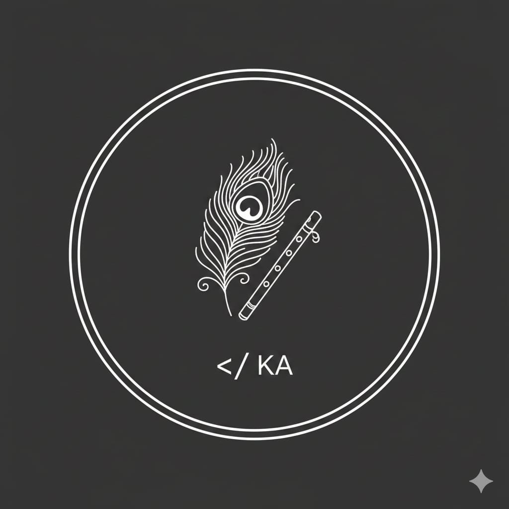

  

## ✨ Kritika Arora ✨

### <em style="color:#b18cd9;">build with intention · refine with patience · evolve quietly</em>

 

━━━༺ 🎶 ༻━━━

---

### 🌿 About Me  

I’m a CS student & developer who likes creating software that feels **clean, intentional, and calm** — both visually and logically.  

I enjoy:

- Designing meaningful, aesthetic user experiences  
- Bringing ideas to life with code  
- Improving quietly & consistently  

---

🦚 ༺━━━༻ 🎶 ༺━━━༻ 🦚

### 🚀 Current Focus  

💠 Full-Stack Development (**MERN**)  
💠 AI + API integrations  
💠 Smooth UI motion & micro-interactions (**GSAP**)  

---

🎶 ༺━━━༻ 🦚 ༺━━━༻ 🎶

### 🎨 Tech Stack  

---

🎶 ༺━━━༻ 🦚 ༺━━━༻ 🎶

### 🧠 What I'm Building  

🔹 **Cogniflow** — a mindful productivity system blending:  
> 🧘 behavior analytics · 🧠 AI planning · 💻 smooth MERN architecture  

---

🦚 ༺━━━༻ 🌿 ༺━━━༻ 🦚

### 📊 Stats Snapshot  

  

---

🌼 ༺━━━༻ 🎶 ༺━━━༻ 🌼

### 🧘 Code Philosophy  

> **कर्मण्येवाधिकारस्ते मा फलेषु कदाचन।**  
> *"Your work is your domain — not the result."*

Learning slowly.  
Improving quietly.  
Building intentionally.  

 

🪷 Radhe Radhe 🪷

